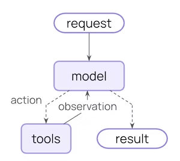
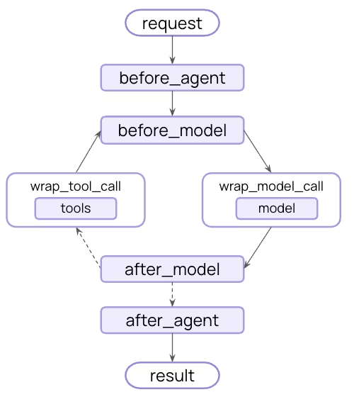

## Middleware
- Control and customize agent execution at every step

- Middleware provides a way to more tightly control what happens inside the agent. Middleware is useful for the following:
    - Tracking agent behavior with logging, analytics, and debugging.
    - Transforming prompts, tool selection, and output formatting.
    - Adding retries, fallbacks, and early termination logic.
    - Applying rate limits, guardrails, and PII detection.

Add middleware by passing them to create_agent:
```python
from langchain.agents import create_agent
# create_agent → builds a LangChain v1 agent that supports tools + middleware.

from langchain.agents.middleware import (
    SummarizationMiddleware,
    HumanInTheLoopMiddleware
)
# SummarizationMiddleware → automatically summarizes long message history.
# HumanInTheLoopMiddleware → pauses execution and requests user approval
#                            before taking certain actions (like tool calls).


# -----------------------------------------------------------
# CREATE THE AGENT WITH MULTIPLE MIDDLEWARE LAYERS
# -----------------------------------------------------------
agent = create_agent(
    model="gpt-4o",       # Main LLM used to drive the agent
    tools=[...],          # Tools the agent is allowed to call

    middleware=[
        # 1) Summarization middleware
        #
        #    Automatically triggers when message history grows large.
        #    Replaces older messages with a compact summary while keeping
        #    the most recent ones untouched.
        #
        #    Useful for: long conversations, multi-step agents, QA systems.
        SummarizationMiddleware(...),

        # 2) Human-in-the-Loop middleware
        #
        #    Pauses the agent and requires end-user input before allowing:
        #    - tool calls,
        #    - external API executions,
        #    - sensitive actions.
        #
        #    This guarantees safety and control in interactive systems.
        HumanInTheLoopMiddleware(...)
    ],
)
```

## The agent loop
- The core agent loop involves calling a model, letting it choose tools to execute, and then finishing when it calls no more tools:
    - Core agent loop diagram


---


- Middleware exposes hooks before and after each of those steps:
    - Middleware flow diagram



---

