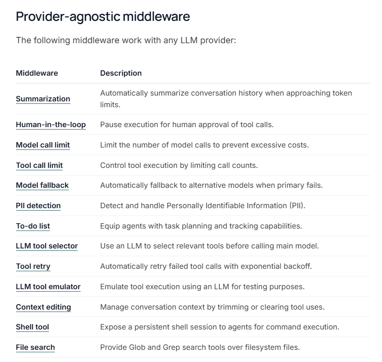

LangChain provides prebuilt middleware for common use cases. Each middleware is production-ready and configurable for your specific needs.



---

## 1. Summarization
Automatically summarize conversation history when approaching token limits, preserving recent messages while compressing older context. Summarization is useful for the following:
Long-running conversations that exceed context windows.
Multi-turn dialogues with extensive history.
Applications where preserving full conversation context matters.
```python
from langchain.agents import create_agent
from langchain.agents.middleware import SummarizationMiddleware


# Single condition: trigger if tokens >= 4000 AND messages >= 10
agent = create_agent(
    model="gpt-4o",
    tools=[weather_tool, calculator_tool],
    middleware=[
        SummarizationMiddleware(
            model="gpt-4o-mini",
            trigger={"tokens": 4000, "messages": 10},
            keep={"messages": 20},
        ),
    ],
)

# Multiple conditions
agent2 = create_agent(
    model="gpt-4o",
    tools=[weather_tool, calculator_tool],
    middleware=[
        SummarizationMiddleware(
            model="gpt-4o-mini",
            trigger=[
                {"tokens": 5000, "messages": 3},
                {"tokens": 3000, "messages": 6},
            ],
            keep={"messages": 20},
        ),
    ],
)

# Using fractional limits
agent3 = create_agent(
    model="gpt-4o",
    tools=[weather_tool, calculator_tool],
    middleware=[
        SummarizationMiddleware(
            model="gpt-4o-mini",
            trigger={"fraction": 0.8},
            keep={"fraction": 0.3},
        ),
    ],
)
```


## 2. Human-in-the-loop
Pause agent execution for human approval, editing, or rejection of tool calls before they execute. Human-in-the-loop is useful for the following:
High-stakes operations requiring human approval (e.g. database writes, financial transactions).
Compliance workflows where human oversight is mandatory.
Long-running conversations where human feedback guides the agent.
```python
from langchain.agents import create_agent
from langchain.agents.middleware import HumanInTheLoopMiddleware
from langgraph.checkpoint.memory import InMemorySaver

agent = create_agent(
    model="gpt-4o",
    tools=[read_email_tool, send_email_tool],
    checkpointer=InMemorySaver(),
    middleware=[
        HumanInTheLoopMiddleware(
            interrupt_on={
                "send_email_tool": {
                    "allowed_decisions": ["approve", "edit", "reject"],
                },
                "read_email_tool": False,
            }
        ),
    ],
)
```

## Model call limit
- Limit the number of model calls to prevent infinite loops or excessive costs. Model call limit is useful for the following:
    - Preventing runaway agents from making too many API calls.
    - Enforcing cost controls on production deployments.
    - Testing agent behavior within specific call budgets.

```python
from langchain.agents import create_agent
from langchain.agents.middleware import ModelCallLimitMiddleware

agent = create_agent(
    model="gpt-4o",
    tools=[...],
    middleware=[
        ModelCallLimitMiddleware(
            thread_limit=10,
            run_limit=5,
            exit_behavior="end",
        ),
    ],
)
```
## Tool call limit
- Control agent execution by limiting the number of tool calls, either globally across all tools or for specific tools. Tool call limits are useful for the following:
    - Preventing excessive calls to expensive external APIs.
    - Limiting web searches or database queries.
    - Enforcing rate limits on specific tool usage.
    - Protecting against runaway agent loops.
```python
from langchain.agents import create_agent
from langchain.agents.middleware import ToolCallLimitMiddleware

agent = create_agent(
    model="gpt-4o",
    tools=[search_tool, database_tool],
    middleware=[
        # Global limit
        ToolCallLimitMiddleware(thread_limit=20, run_limit=10),
        # Tool-specific limit
        ToolCallLimitMiddleware(
            tool_name="search",
            thread_limit=5,
            run_limit=3,
        ),
    ],
)
```
## Model fallback
- Automatically fallback to alternative models when the primary model fails. Model fallback is useful for the following:
    - Building resilient agents that handle model outages.
    - Cost optimization by falling back to cheaper models.
    - Provider redundancy across OpenAI, Anthropic, etc.

```python
from langchain.agents import create_agent
from langchain.agents.middleware import ModelFallbackMiddleware

agent = create_agent(
    model="gpt-4o",
    tools=[...],
    middleware=[
        ModelFallbackMiddleware(
            "gpt-4o-mini",
            "claude-3-5-sonnet-20241022",
        ),
    ],
)
```
## PII detection
- Detect and handle Personally Identifiable Information (PII) in conversations using configurable strategies. PII detection is useful for the following:
    - Healthcare and financial applications with compliance requirements.
    - Customer service agents that need to sanitize logs.
    - Any application handling sensitive user data.

```python
from langchain.agents import create_agent
from langchain.agents.middleware import PIIMiddleware

agent = create_agent(
    model="gpt-4o",
    tools=[...],
    middleware=[
        PIIMiddleware("email", strategy="redact", apply_to_input=True),
        PIIMiddleware("credit_card", strategy="mask", apply_to_input=True),
    ],
)
```

## To-do list
- Equip agents with task planning and tracking capabilities for complex multi-step tasks. To-do lists are useful for the following:
    - Complex multi-step tasks requiring coordination across multiple tools.
    - Long-running operations where progress visibility is important.

```python
from langchain.agents import create_agent
from langchain.agents.middleware import TodoListMiddleware
from langchain.tools import tool

# -----------------------------------------------------------
# Define simple tools the agent can use
# -----------------------------------------------------------

@tool
def read_file(path: str) -> str:
    """Read a file from disk."""
    return f"[fake read] contents of {path}"

@tool
def write_file(path: str, content: str) -> str:
    """Write content to a file."""
    return f"[fake write] wrote {len(content)} chars to {path}"

@tool
def run_tests(_: None = None) -> str:
    """Simulate running tests."""
    return "[fake tests] All tests passed!"


# -----------------------------------------------------------
# Create the agent with a To-do list middleware
# -----------------------------------------------------------
agent = create_agent(
    model="gpt-4o",                         # Main LLM
    tools=[read_file, write_file, run_tests],  # Tools the agent will call
    middleware=[TodoListMiddleware()],      # Enable task planning + progress tracking
)


# -----------------------------------------------------------
# Ask the agent to perform a complex multi-step task
# -----------------------------------------------------------
result = agent.invoke({
    "messages": [{
        "role": "user",
        "content": (
            "Update the README file so that it includes a Quickstart section, "
            "then save it, and finally run the unit tests to confirm everything still works."
        )
    }]
})

# Print the final messages produced by the agent:
for m in result["messages"]:
    m.pretty_print()

```

## LLM tool selector
- Use an LLM to intelligently select relevant tools before calling the main model. LLM tool selectors are useful for the following:
    - Agents with many tools (10+) where most aren’t relevant per query.
    - Reducing token usage by filtering irrelevant tools.
    - Improving model focus and accuracy.
This middleware uses structured output to ask an LLM which tools are most relevant for the current query. The structured output schema defines the available tool names and descriptions. Model providers often add this structured output information to the system prompt behind the scenes.

```python
from langchain.agents import create_agent
# create_agent → builds a LangChain v1 agent

from langchain.agents.middleware import LLMToolSelectorMiddleware
# LLMToolSelectorMiddleware →
#   Uses a *separate* lightweight LLM to decide which tools
#   should be made available for the main agent call.
#
#   This solves the problem of:
#     - having too many tools
#     - unnecessary tool confusion
#     - high token usage from huge tool lists


# -----------------------------------------------------------
# CREATE AN AGENT WITH LLM-POWERED TOOL SELECTION
# -----------------------------------------------------------
agent = create_agent(
    model="gpt-4o",               # Main, powerful LLM that performs the task

    tools=[tool1, tool2, tool3, tool4, tool5, ...],
    # The agent *could* use all tools, but we will filter them
    # using the Tool Selector middleware.

    middleware=[
        LLMToolSelectorMiddleware(
            model="gpt-4o-mini",    # A smaller + cheaper LLM for choosing tools
                                    # (fast, low-cost filtering step)

            max_tools=3,            # Select at most 3 tools to expose to the agent
                                    # Helps reduce confusion + speeds up execution

            always_include=["search"],
            # Ensure that certain critical tools ALWAYS remain available,
            # even if the selector LLM does not choose them.
            #
            # Example:
            #   search, wikipedia, retrieve_doc
        ),
    ],
)
```

## Tool retry
- Automatically retry failed tool calls with configurable exponential backoff. Tool retry is useful for the following:
    - Handling transient failures in external API calls.
    - Improving reliability of network-dependent tools.
    - Building resilient agents that gracefully handle temporary errors.
```python
from langchain.agents import create_agent
from langchain.agents.middleware import ToolRetryMiddleware


agent = create_agent(
    model="gpt-4o",
    tools=[search_tool, database_tool, api_tool],
    middleware=[
        ToolRetryMiddleware(
            max_retries=3,
            backoff_factor=2.0,
            initial_delay=1.0,
            max_delay=60.0,
            jitter=True,
            tools=["api_tool"],
            retry_on=(ConnectionError, TimeoutError),
            on_failure="return_message",
        ),
    ],
)
```

## LLM tool emulator
- Emulate tool execution using an LLM for testing purposes, replacing actual tool calls with AI-generated responses. LLM tool emulators are useful for the following:
    - Testing agent behavior without executing real tools.
    - Developing agents when external tools are unavailable or expensive.
    - Prototyping agent workflows before implementing actual tools.

## Context editing
- Manage conversation context by clearing older tool call outputs when token limits are reached, while preserving recent results. This helps keep context windows manageable in long conversations with many tool calls. Context editing is useful for the following:
    - Long conversations with many tool calls that exceed token limits
    - Reducing token costs by removing older tool outputs that are no longer relevant
    - Maintaining only the most recent N tool results in context

## Shell tool
Expose a persistent shell session to agents for command execution. Shell tool middleware is useful for the following:
    - Agents that need to execute system commands
    - Development and deployment automation tasks
    - Testing and validation workflows
    - File system operations and script execution

## File search
Provide Glob and Grep search tools over filesystem files. File search middleware is useful for the following:
    - Code exploration and analysis
    - Finding files by name patterns
    - Searching code content with regex
    - Large codebases where file discovery is needed

# Provider-specific middleware

...
...
https://docs.langchain.com/oss/python/langchain/middleware/built-in#provider-specific-middleware