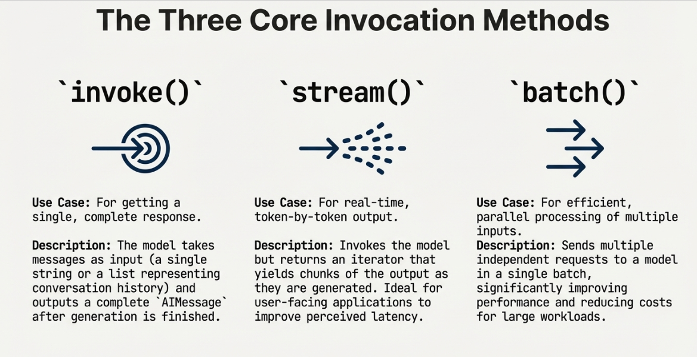

## Invocation
A chat model must be invoked to generate an output. There are three primary invocation methods, each suited to different use cases.



---
​
### 1. Invoke
The most straightforward way to call a model is to use invoke() with a single message or a list of messages.
Single message
```python
response = model.invoke("Why do parrots have colorful feathers?")
print(response)
```

- A list of messages can be provided to a model to represent conversation history. Each message has a role that models use to indicate who sent the message in the conversation.
- main2_invoke.py
- Run Example
```bash
uv --project uv_env/ run python week_05_langchain/01_core_components/02_models/main2_invoke.py
```
- Output
```
J'adore créer des applications.
```
### 2. Stream
- Most models can stream their output content while it is being generated. By displaying output progressively, streaming significantly improves user experience, particularly for longer responses.
- Calling stream() returns an iterator that yields output chunks as they are produced. You can use a loop to process each chunk in real-time:
- main3_stream.py
- Run
```bash
uv --project uv_env/ run python week_05_langchain/01_core_components/02_models/main2_invoke.py
```
- Output (Results will appear part by part)
```
Parrots have colorful feathers for| a variety of reasons, and it's a fascinating interplay of **evolutionary| pressures and social behaviors**. Here are the main drivers behind their vibrant plumage:

**1. Communication and Social Signaling:**

* **Mate Attraction:** This ...
...
...
```
### 3. Batch
#### 3.1. batch()
- Batching a collection of independent requests to a model can significantly improve performance and reduce costs, as the processing can be done in parallel:
- main4_batch.py
```python
...
...
# return the final output for the entire batch
responses = model.batch([
    "Why do parrots have colorful feathers?",
    "How do airplanes fly?",
    "What is quantum computing?"
],
config={
        'max_concurrency': 5,  # Limit to 5 parallel calls
        # See the RunnableConfig reference for a full list of supported attributes.
    })
...
...
```
- Run
```bash
uv --project uv_env/ run python week_05_langchain/01_core_components/02_models/main4_batch.py
```
#### 3.2. batch_as_completed()
- By default, batch() will only return the final output for the entire batch. If you want to receive the output for each individual input as it finishes generating, you can stream results with batch_as_completed():
Yield batch responses upon completion
- main5_batch_as_completed.py
```python
...
...
for response in model.batch_as_completed([
    "Why do parrots have colorful feathers?",
    "How do airplanes fly?",
    "What is quantum computing?"
]):
    print(response)
```
- Run
```bash
uv --project uv_env/ run python week_05_langchain/01_core_components/02_models/main5_batch_as_completed.py
```

### 4. Invocation config
- When invoking a model, you can pass additional configuration through the config parameter using a RunnableConfig dictionary. This provides run-time control over execution behavior, callbacks, and metadata tracking.
```python
response = model.invoke(
    "Tell me a joke",
    config={
        "run_name": "joke_generation",      # Custom name for this run
        "tags": ["humor", "demo"],          # Tags for categorization
        "metadata": {"user_id": "123"},     # Custom metadata
        "callbacks": [my_callback_handler], # Callback handlers
    }
)
```