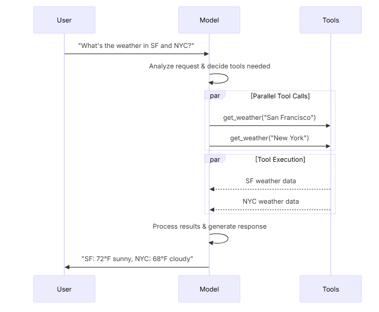

## Tool calling
- Models can request to call tools that perform tasks such as fetching data from a database, searching the web, or running code. Tools are pairings of:
    - A schema, including the name of the tool, a description, and/or argument definitions (often a JSON schema)
    - A function or coroutine to execute.



---

- To make tools that you have defined available for use by a model, you must bind them using bind_tools.
- main6_tool_calling.py
```python
...
from langchain.tools import tool

...

@tool
def get_weather(location: str) -> str:
    """Get the weather at a location."""
    return f"It's sunny in {location}."


model_with_tools = model.bind_tools([get_weather])  

response = model_with_tools.invoke("What's the weather like in Boston?")
...
```

- Run
```bash
uv --project uv_env/ run python week_05_langchain/01_core_components/02_models/main6_tool_calling.py
```
- Output
```
Tool: get_weather
Args: {'location': 'Boston'}
```