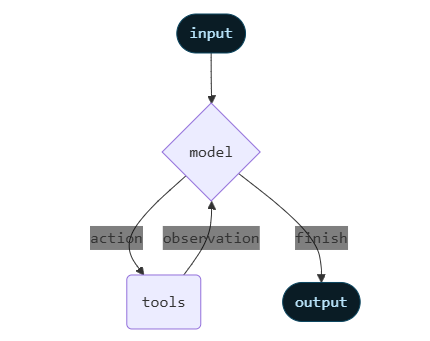

## Agents
- Agents combine language models with tools to create systems that can reason about tasks, decide which tools to use, and iteratively work towards solutions.
- Agents follow the **ReAct (“Reasoning + Acting”)** pattern, alternating between brief reasoning steps with targeted tool calls and feeding the resulting observations into subsequent decisions until they can deliver a final answer.

- `create_agent` provides a production-ready agent implementation.

- An LLM Agent runs tools in a loop to achieve a goal. An agent runs until a stop condition is met - i.e., **when the model emits a final output or an iteration limit is reached.**

---