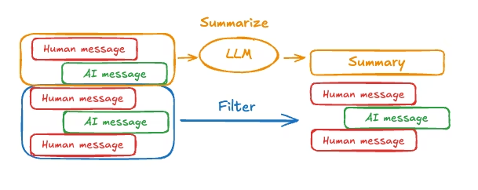

## Memory Management
- With short-term memory enabled, long conversations can exceed the LLM’s context window. Common solutions are:

### 1. Trim messages
- Most LLMs have a maximum supported context window (denominated in tokens).
- One way to decide when to truncate messages is to count the tokens in the message history and truncate whenever it approaches that limit. If you’re using LangChain, you can use the trim messages utility and specify the number of tokens to keep from the list, as well as the strategy (e.g., keep the last max_tokens) to use for handling the boundary.
- To trim message history in an agent, use the @before_model middleware decorator:
```python
from langchain.messages import RemoveMessage
# RemoveMessage is a special command to delete messages from memory.

from langgraph.graph.message import REMOVE_ALL_MESSAGES
# Constant used to indicate "delete every stored message".

from langgraph.checkpoint.memory import InMemorySaver
# In-memory checkpoint store to keep conversation state between invocations.

from langchain.agents import create_agent, AgentState
# create_agent builds a v1-style agent.
# AgentState is the container holding messages and other runtime info.

from langchain.agents.middleware import before_model
# Decorator that allows us to run custom logic BEFORE the LLM is called.

from langgraph.runtime import Runtime
# Runtime object includes metadata and the memory operations applied.

from langchain_core.runnables import RunnableConfig
# Standard config object for LangChain runnables (thread_id, metadata, etc.).

from typing import Any
# Just Python typing.


# -----------------------------------------------------------
# MIDDLEWARE: Runs before the model call.
# It trims message history to keep context window small.
# -----------------------------------------------------------
@before_model
def trim_messages(state: AgentState, runtime: Runtime) -> dict[str, Any] | None:
    """Keep only the last few messages to fit context window."""

    # Extract the current stored conversation messages
    messages = state["messages"]

    # If short conversation, nothing to trim
    if len(messages) <= 3:
        return None

    # Always keep the very first message (often system or initial user)
    first_msg = messages[0]

    # Keep last 3 or last 4 messages depending on even/odd number of messages
    # (This is just an example heuristic.)
    recent_messages = messages[-3:] if len(messages) % 2 == 0 else messages[-4:]

    # New trimmed list: first message + last few
    new_messages = [first_msg] + recent_messages

    # Return instructions to rewrite the agent's memory:
    # 1) Remove ALL existing messages
    # 2) Insert back only trimmed messages
    return {
        "messages": [
            RemoveMessage(id=REMOVE_ALL_MESSAGES),  # clear memory
            *new_messages                             # add trimmed history
        ]
    }


# -----------------------------------------------------------
# CREATE THE AGENT
# -----------------------------------------------------------
agent = create_agent(
    model,                   # Your LLM (Gemini 2.5 Flash in your environment)
    tools=tools,             # Any tools you passed in
    middleware=[trim_messages],  # Attach our custom middleware
    checkpointer=InMemorySaver(), # Store conversation history in memory
)


# -----------------------------------------------------------
# CONFIG (VERY IMPORTANT)
# Using a fixed thread_id means all calls share the same memory.
# -----------------------------------------------------------
config: RunnableConfig = {"configurable": {"thread_id": "1"}}


# -----------------------------------------------------------
# INTERACTIONS WITH THE AGENT
# Each call updates memory, then middleware trims it.
# -----------------------------------------------------------
agent.invoke({"messages": "hi, my name is bob"}, config)
agent.invoke({"messages": "write a short poem about cats"}, config)
agent.invoke({"messages": "now do the same but for dogs"}, config)

# Ask the model to recall earlier information
final_response = agent.invoke({"messages": "what's my name?"}, config)

# Print last AI message
final_response["messages"][-1].pretty_print()
"""
Should output:
Your name is Bob.
"""
```
- Run
```
uv --project uv_env/ run python week_05_langchain/01_core_components/06_short_term_memory/main2_trimming_messages.py
```
### 2. Delete messages
- You can delete messages from the graph state to manage the message history. This is useful when you want to remove specific messages or clear the entire message history. To delete messages from the graph state, you can use the RemoveMessage. For RemoveMessage to work, you need to use a state key with add_messages reducer. The default AgentState provides this.

```python
from langchain.messages import RemoveMessage, REMOVE_ALL_MESSAGES

def delete_messages(state):
    messages = state["messages"]
    if len(messages) > 2:
        # remove the earliest two messages
        return {"messages": [RemoveMessage(id=m.id) for m in messages[:2]]}

# Or remove all messages
def delete_messages(state):
    return {"messages": [RemoveMessage(id=REMOVE_ALL_MESSAGES)]}  

```
-
```python
from langchain.messages import RemoveMessage
# RemoveMessage is used to delete specific messages from the agent's memory.

from langchain.agents import create_agent, AgentState
# create_agent: builds a LangChain v1 agent.
# AgentState: contains the agent's stored messages + internal state.

from langchain.agents.middleware import after_model
# after_model: decorator that runs middleware AFTER the LLM generates a response.

from langgraph.checkpoint.memory import InMemorySaver
# InMemorySaver stores all messages/checkpoints in memory so multiple
# agent calls can share conversation state.

from langgraph.runtime import Runtime
# Runtime object provides context for message updates and memory operations.

from langchain_core.runnables import RunnableConfig
# RunnableConfig is used to pass thread_id and metadata to the agent.


# -----------------------------------------------------------
# MIDDLEWARE: Runs AFTER the LLM produces its output.
# This middleware deletes older messages to manage history size.
# -----------------------------------------------------------
@after_model
def delete_old_messages(state: AgentState, runtime: Runtime) -> dict | None:
    """Remove old messages to keep conversation manageable."""
    
    # Pull the message history from the agent's internal state
    messages = state["messages"]

    # If more than 2 messages exist, delete the earliest two
    if len(messages) > 2:
        # Create RemoveMessage commands for the oldest messages
        return {"messages": [RemoveMessage(id=m.id) for m in messages[:2]]}

    # If not enough messages, do nothing
    return None


# -----------------------------------------------------------
# CREATE THE AGENT
# -----------------------------------------------------------
agent = create_agent(
    "gpt-5-nano",           # The LLM model to use
    tools=[],               # No tools used in this example
    system_prompt="Please be concise and to the point.",  # Global system instruction
    middleware=[delete_old_messages],  # Apply our message-deletion middleware
    checkpointer=InMemorySaver(),      # Persist memory in RAM
)


# -----------------------------------------------------------
# CONFIGURATION (VERY IMPORTANT)
# thread_id ensures that all calls share the same memory state.
# Without thread_id, each call starts from scratch.
# -----------------------------------------------------------
config: RunnableConfig = {"configurable": {"thread_id": "1"}}


# -----------------------------------------------------------
# FIRST STREAMED CALL
# User says: "hi! I'm bob"
# Middleware will run AFTER the model responds.
# Output is streamed event-by-event.
# -----------------------------------------------------------
for event in agent.stream(
    {"messages": [{"role": "user", "content": "hi! I'm bob"}]},
    config,
    stream_mode="values",
):
    # Print message types + text content
    print([(message.type, message.content) for message in event["messages"]])


# -----------------------------------------------------------
# SECOND STREAMED CALL
# User asks: "what's my name?"
# Agent attempts to recall earlier messages,
# but our middleware may have trimmed old messages!
# -----------------------------------------------------------
for event in agent.stream(
    {"messages": [{"role": "user", "content": "what's my name?"}]},
    config,
    stream_mode="values",
):
    # Observe whether the model still remembers "bob"
    print([(message.type, message.content) for message in event["messages"]])
```
- Run
```bash
uv --project uv_env/ run python week_05_langchain/01_core_components/06_short_term_memory/main3_delete_messages.py
```

### 3. Summarize messages
- The problem with trimming or removing messages, as shown above, is that you may lose information from culling of the message queue. Because of this, some applications benefit from a more sophisticated approach of summarizing the message history using a chat model.



---

- To summarize message history in an agent, use the built-in SummarizationMiddleware:
```python
from langchain.agents import create_agent
# create_agent: builds a LangChain v1 agent.

from langchain.agents.middleware import SummarizationMiddleware
# SummarizationMiddleware automatically summarizes old messages
# when the conversation becomes too long. This prevents context overflow.

from langgraph.checkpoint.memory import InMemorySaver
# InMemorySaver stores conversation state (messages, summaries, etc.)
# in memory so multiple agent calls can share history.

from langchain_core.runnables import RunnableConfig
# RunnableConfig lets us pass thread_id and metadata into the agent.


# -----------------------------------------------------------
# CREATE A MEMORY CHECKPOINTER
# -----------------------------------------------------------
checkpointer = InMemorySaver()
# All agent.invoke() calls using the same thread_id will share memory via this object.


# -----------------------------------------------------------
# CREATE THE AGENT WITH SUMMARIZATION MIDDLEWARE
# -----------------------------------------------------------
agent = create_agent(
    model="gpt-4o",   # Main LLM responding to the user
    tools=[],         # No tools in this example

    middleware=[
        SummarizationMiddleware(
            model="gpt-4o-mini",        # The model used to produce summaries
            max_tokens_before_summary=4000,  # When message history exceeds this many tokens,
                                             # a summary will be generated.
            messages_to_keep=20,        # After summarization, keep the last 20 raw messages
                                         # (older messages are replaced with a compressed summary)
        )
    ],

    checkpointer=checkpointer,  # Enables persistent memory between calls
)


# -----------------------------------------------------------
# CONFIGURATION (IMPORTANT)
# thread_id ensures all calls share the same memory state.
# Without it, each invoke would start fresh.
# -----------------------------------------------------------
config: RunnableConfig = {"configurable": {"thread_id": "1"}}


# -----------------------------------------------------------
# AGENT INTERACTIONS
# These calls accumulate memory →
# SummarizationMiddleware trims & summarizes when needed.
# -----------------------------------------------------------
agent.invoke({"messages": "hi, my name is bob"}, config)
agent.invoke({"messages": "write a short poem about cats"}, config)
agent.invoke({"messages": "now do the same but for dogs"}, config)

# Now ask the agent to recall earlier info:
final_response = agent.invoke({"messages": "what's my name?"}, config)


# -----------------------------------------------------------
# PRINT FINAL ANSWER
# The agent should still remember "bob", even if summarization occurred.
# -----------------------------------------------------------
final_response["messages"][-1].pretty_print()

"""
================================== Ai Message ==================================

Your name is Bob!
"""
```

### 4. Custom strategies
Custom strategies (e.g., message filtering, etc.)

- More options: https://docs.langchain.com/oss/python/langchain/middleware#summarization