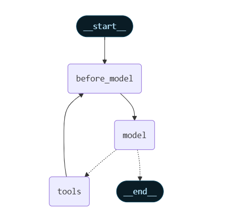
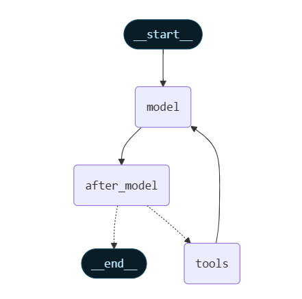

### In the following examples you will see:
- How to use @before_model middleware to trim messages before LLM calls
- How to use @after_model middleware to validate responses after LLM calls
- How middleware can modify agent state by adding/removing messages
- How memory management works with trimming and validation
## Before model
- Access short term memory (state) in @before_model middleware to process messages before model calls.



---

#### before_model
```python
from langchain.messages import RemoveMessage
# RemoveMessage is a special instruction telling the agent to delete messages from memory.

from langgraph.graph.message import REMOVE_ALL_MESSAGES
# Constant used to indicate "delete every message currently stored".

from langgraph.checkpoint.memory import InMemorySaver
# Optional: a checkpoint store that keeps conversation memory between invocations.

from langchain.agents import create_agent, AgentState
# create_agent: builds a LangChain v1 agent.
# AgentState: contains the agent’s memory (messages + any custom state fields).

from langchain.agents.middleware import before_model
# before_model: decorator to run logic BEFORE the LLM is invoked.

from langgraph.runtime import Runtime
# Runtime provides access to memory operations and execution context.

from typing import Any
# Standard typing utilities.


# -----------------------------------------------------------
# MIDDLEWARE: TRIM MESSAGE HISTORY BEFORE EACH MODEL CALL
# -----------------------------------------------------------
@before_model
def trim_messages(state: AgentState, runtime: Runtime) -> dict[str, Any] | None:
    """
    Keep only the last few messages to fit within the LLM's context window.
    Runs BEFORE the LLM is called.
    """
    
    # The conversation history currently stored by the agent
    messages = state["messages"]

    # If history is short, no trimming needed
    if len(messages) <= 3:
        return None

    # Always keep the very first message (often a system message)
    first_msg = messages[0]

    # Keep the last 3 or last 4 messages depending on even/odd count
    # This is just an example trimming strategy
    recent_messages = messages[-3:] if len(messages) % 2 == 0 else messages[-4:]

    # Construct the trimmed message list
    new_messages = [first_msg] + recent_messages

    # Return instructions to:
    # 1) Delete ALL stored messages
    # 2) Replace them with the trimmed ones
    return {
        "messages": [
            RemoveMessage(id=REMOVE_ALL_MESSAGES),  # Clear memory
            *new_messages                            # Insert trimmed history
        ]
    }


# -----------------------------------------------------------
# CREATE THE AGENT
# -----------------------------------------------------------
agent = create_agent(
    model,                # The LLM (e.g., Gemini 2.5 Flash in your environment)
    tools=tools,          # Any tools provided to the agent
    middleware=[trim_messages],  # Attach the trimming middleware
)


# -----------------------------------------------------------
# CONFIGURATION (IMPORTANT)
# thread_id ensures the agent retains memory across calls.
# Without this, every invoke() would start from scratch.
# -----------------------------------------------------------
config: RunnableConfig = {"configurable": {"thread_id": "1"}}


# -----------------------------------------------------------
# AGENT INTERACTIONS
# Memory grows → middleware trims it before each call.
# -----------------------------------------------------------
agent.invoke({"messages": "hi, my name is bob"}, config)
agent.invoke({"messages": "write a short poem about cats"}, config)
agent.invoke({"messages": "now do the same but for dogs"}, config)

# Ask the agent to recall earlier info
final_response = agent.invoke({"messages": "what's my name?"}, config)


# -----------------------------------------------------------
# PRINT FINAL ANSWER
# Should correctly return: "Your name is Bob."
# -----------------------------------------------------------
final_response["messages"][-1].pretty_print()

"""
================================== Ai Message ==================================

Your name is Bob. You told me that earlier.
If you'd like me to call you a nickname or use a different name, just say the word.
"""
```

## After Model



---

#### after_model
```python
from langchain.messages import RemoveMessage
# RemoveMessage: special instruction to delete a specific message by ID.

from langgraph.checkpoint.memory import InMemorySaver
# InMemorySaver: stores agent memory (messages + state) between invocations.

from langchain.agents import create_agent, AgentState
# create_agent: builds a LangChain v1 agent.
# AgentState: stores messages + optional custom state fields.

from langchain.agents.middleware import after_model
# after_model: decorator for middleware that runs AFTER the LLM generates a response.

from langgraph.runtime import Runtime
# Runtime: provides context and access to the memory system.


# -----------------------------------------------------------
# MIDDLEWARE: VALIDATE THE MODEL'S RESPONSE *AFTER* GENERATION
# -----------------------------------------------------------
@after_model
def validate_response(state: AgentState, runtime: Runtime) -> dict | None:
    """
    Remove any model-generated message that contains sensitive words.
    This middleware runs AFTER the model finishes responding.
    """

    # Words that should never appear in the final output
    STOP_WORDS = ["password", "secret"]

    # The most recent (LLM) message
    last_message = state["messages"][-1]

    # If the LLM output contains any forbidden word → delete that message
    if any(word in last_message.content for word in STOP_WORDS):
        return {
            "messages": [
                RemoveMessage(id=last_message.id)  # Remove the unsafe response
            ]
        }

    # If safe → do nothing
    return None


# -----------------------------------------------------------
# CREATE THE AGENT
# -----------------------------------------------------------
agent = create_agent(
    model="gpt-5-nano",       # The LLM
    tools=[],                 # No tools used here
    middleware=[validate_response],  # Attach our response-validation middleware
    checkpointer=InMemorySaver(),    # Store memory so agent can continue across runs
)
```